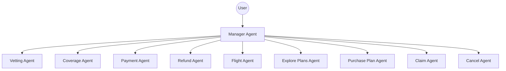
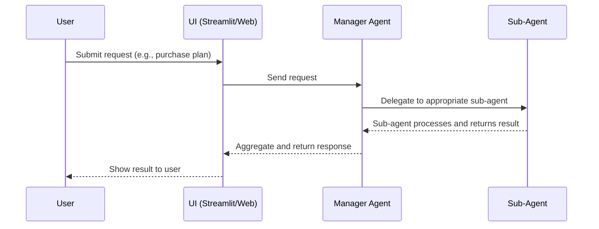

# Travel Insurance Multi-Agent System Documentation

## Overview
This project implements a multi-agent system for a Travel Insurance platform using Google ADK. The system automates and streamlines the management of travel insurance, including plan exploration, purchase, claims, cancellations, payments, vetting, coverage, refunds, and flight-related queries.

At the core is the **Manager Agent**, which intelligently delegates user requests to specialized sub-agents based on the nature of the query.

---

## Architecture Diagram


---

## Agent Descriptions

### Manager Agent
- **Role:** Central coordinator and router for all user requests.
- **Responsibilities:**
  - Receives all user queries.
  - Determines which sub-agent is best suited to handle the request.
  - Delegates the task to the appropriate sub-agent.
  - Aggregates and returns responses to the user.

### Vetting Agent
- **Role:** Eligibility and user vetting.
- **Responsibilities:**
  - Checks user eligibility for travel insurance plans.
  - Verifies user information and travel details.
  - Ensures compliance with policy requirements.
  - Provides feedback on eligibility status.

### Coverage Agent
- **Role:** Insurance plan and coverage details.
- **Responsibilities:**
  - Provides details about available insurance plans.
  - Explains coverage, exclusions, and benefits.
  - Assists users in selecting the right plan.
  - Answers questions about policy terms and conditions.

### Payment Agent
- **Role:** Payment processing.
- **Responsibilities:**
  - Processes payments for all plan types.
  - Accepts and validates various payment forms (Visa, MasterCard, Amex, Discover, PayPal).
  - Handles refunds as per plan rules (e.g., unused plans).
  - Ensures secure and compliant payment processing.
  - Provides confirmation and reference for each transaction.

### Refund Agent
- **Role:** Refund processing and policy cancellations.
- **Responsibilities:**
  - Processes refunds for travel insurance plans according to policy terms.
  - Handles full, partial, and no refunds based on eligibility.
  - Manages subscription cancellations and special cases (e.g., medical emergencies, duplicate payments).
  - Maintains refund logs and compliance.

### Flight Agent
- **Role:** Flight search, booking, and status.
- **Responsibilities:**
  - Searches for flights based on user criteria.
  - Provides flight options, prices, and airlines using Google Flights data.
  - Assists with booking, reservation, and status updates.
  - Answers questions about baggage, layovers, and travel policies.

### Explore Plans Agent
- **Role:** Plan exploration and comparison.
- **Responsibilities:**
  - Presents all available travel insurance plans.
  - Explains differences between plans (coverage, price, duration, eligibility).
  - Helps users compare and select the best plan.
  - Answers questions about plan benefits and limitations.

### Purchase Plan Agent
- **Role:** Plan purchase facilitation.
- **Responsibilities:**
  - Guides users through the process of purchasing a plan.
  - Collects necessary information and validates input.
  - Explains the payment process and confirms purchase.
  - Provides confirmation and reference numbers.

### Claim Agent
- **Role:** Insurance claim management.
- **Responsibilities:**
  - Helps users file and manage insurance claims.
  - Collects required documentation.
  - Explains the claim process, eligibility, and timelines.
  - Provides updates on claim status.

### Cancel Agent
- **Role:** Plan cancellation and refund guidance.
- **Responsibilities:**
  - Guides users through plan cancellation.
  - Explains refund eligibility and cancellation policies.
  - Confirms cancellation and provides reference numbers.
  - Informs users about refund timelines.

---

## Technical Details

### Technology Stack
- **Language:** Python 3.10+
- **Framework:** Google ADK (Agent Development Kit)
- **Model:** Gemini 2.5 Pro Preview (`gemini-2.5-pro-preview-03-25`)
- **UI:** Streamlit (for user-facing mockups and demos)
- **Database:** (Optional, for production) SQLite, PostgreSQL, or any supported backend
- **Authentication:** (Optional) Streamlit-authenticator, OAuth, or custom

### Agent Registration
- All sub-agents are registered in `manager_agent/sub_agents/__init__.py` and imported in `manager_agent/agent.py`.
- The `root_agent` (manager agent) delegates to sub-agents via the `sub_agents` parameter.

### Extensibility
- New sub-agents can be added for additional features (e.g., travel alerts, customer support).
- Each agent's logic and instructions can be updated independently.
- The system can be integrated with external APIs (e.g., payment gateways, flight data, etc.).
- The UI can be extended for production use with authentication, persistent storage, and real-time updates.

### Example Agent Registration (Python)
```python
from .sub_agents import (
    refund_agent, payment_agent, vetting_agent, coverage_agent, flight_agent,
    explore_plans_agent, purchase_plan_agent, claim_agent, cancel_agent
)

root_agent = Agent(
    name="manager_agent",
    model="gemini-2.5-pro-preview-03-25",
    ...
    sub_agents=[
        vetting_agent, coverage_agent, payment_agent, refund_agent, flight_agent,
        explore_plans_agent, purchase_plan_agent, claim_agent, cancel_agent
    ],
)
```

---

## How It Works
1. **User Interaction:** The user interacts with the system (via web UI, Streamlit, or API).
2. **Manager Agent Routing:** The manager agent receives the request, determines the intent, and delegates to the appropriate sub-agent.
3. **Sub-Agent Processing:** The sub-agent processes the request, performs its specialized task, and returns a response.
4. **Response Aggregation:** The manager agent collects the response and presents it to the user.

---

## Deployment
- The system is designed to run as a multi-agent application using Google ADK.
- Can be deployed as a web service, integrated with a Streamlit UI, or exposed via API.
- For production, add authentication, persistent storage, and monitoring as needed.

---

## API Endpoints (Example)

| Endpoint | Method | Description |
|----------|--------|-------------|
| `/api/plans` | GET | List all available insurance plans |
| `/api/purchase` | POST | Purchase a selected insurance plan |
| `/api/claim` | POST | File a new insurance claim |
| `/api/cancel` | POST | Cancel an insurance plan |
| `/api/refund` | POST | Request a refund for a plan |
| `/api/payment` | POST | Process a payment |
| `/api/flight/search` | GET | Search for flights |

**Example:**
```http
POST /api/purchase
Content-Type: application/json
{
  "user_id": "123",
  "plan_id": "A1",
  "traveler_info": {...},
  "payment_method": "Visa"
}
```

---

## Database Schema (Example)

### Users
| Field         | Type    | Description                |
|---------------|---------|----------------------------|
| id            | int     | Primary key                |
| name          | string  | User's full name           |
| email         | string  | User's email address       |
| password_hash | string  | Hashed password            |

### Plans
| Field         | Type    | Description                |
|---------------|---------|----------------------------|
| id            | int     | Primary key                |
| name          | string  | Plan name                  |
| description   | string  | Plan description           |
| price         | float   | Plan price                 |
| duration      | int     | Duration in days/months    |

### Transactions
| Field         | Type    | Description                |
|---------------|---------|----------------------------|
| id            | int     | Primary key                |
| user_id       | int     | Foreign key to Users       |
| plan_id       | int     | Foreign key to Plans       |
| amount        | float   | Transaction amount         |
| status        | string  | Status (paid, refunded)    |
| created_at    | datetime| Timestamp                  |

### Claims
| Field         | Type    | Description                |
|---------------|---------|----------------------------|
| id            | int     | Primary key                |
| user_id       | int     | Foreign key to Users       |
| plan_id       | int     | Foreign key to Plans       |
| status        | string  | Status (pending, approved) |
| details       | string  | Claim details              |
| created_at    | datetime| Timestamp                  |

---

## Usage Examples

### Example 1: User Purchases a Plan
1. User explores available plans via `/api/plans`.
2. User selects a plan and submits purchase info to `/api/purchase`.
3. Payment agent processes the payment.
4. Purchase plan agent confirms the purchase and returns a reference number.

### Example 2: User Files a Claim
1. User submits a claim via `/api/claim` with required documentation.
2. Claim agent validates and processes the claim.
3. User receives updates on claim status.

### Example 3: User Requests a Refund
1. User requests a refund via `/api/refund`.
2. Refund agent checks eligibility and processes the refund.
3. User receives confirmation and refund status.

---

## Sequence Diagram: User Request Flow


---

## Error Handling and Logging
- All agents should log errors and important events for monitoring and debugging.
- Common error types: invalid input, payment failure, quota exceeded, API errors.
- Use structured logging and error messages for easier troubleshooting.
- Implement retry logic for transient errors (e.g., network issues).

---

## Security Best Practices
- Store sensitive data (API keys, passwords) securely (e.g., environment variables, secrets manager).
- Use HTTPS for all external communications.
- Hash and salt user passwords.
- Validate and sanitize all user input.
- Implement authentication and authorization for sensitive endpoints.
- Monitor for suspicious activity and enforce rate limits.

---

## Advanced Technical Deep-Dives

### Authentication Flow

#### Streamlit-authenticator Example
- Uses hashed passwords and YAML/DB for user storage.
- Supports registration, login, and session management.
- Can be extended with Google OAuth for SSO.

**Example:**
```python
import streamlit_authenticator as stauth
import yaml
from yaml.loader import SafeLoader

with open('config.yaml') as file:
    config = yaml.load(file, Loader=SafeLoader)

authenticator = stauth.Authenticate(
    config['credentials'],
    config['cookie']['name'],
    config['cookie']['key'],
    config['cookie']['expiry_days'],
    config['preauthorized']
)

name, auth_status, username = authenticator.login('Login', 'main')
if auth_status:
    st.success(f"Welcome {name}!")
```

#### OAuth (Google) Example
- Use `streamlit-authenticator` or Flask-Dance for OAuth.
- Store tokens securely and validate user email/domain.

**Example:**
```python
from flask_dance.contrib.google import make_google_blueprint, google

google_bp = make_google_blueprint(
    client_id="GOOGLE_CLIENT_ID",
    client_secret="GOOGLE_CLIENT_SECRET",
    scope=["profile", "email"]
)
app.register_blueprint(google_bp, url_prefix="/login")
```

---

### Example Deployment Script

#### Local Development
```sh
# Create virtual environment
python -m venv .venv
source .venv/bin/activate  # or .venv\Scripts\activate on Windows
pip install -r requirements.txt

# Run ADK web server
adk web

# In another terminal, run Streamlit UI
streamlit run app1.py
```

#### Cloud Deployment (Streamlit Cloud)
- Push your code to GitHub.
- Go to https://streamlit.io/cloud and connect your repo.
- Set environment variables (API keys, etc.) in the Streamlit Cloud settings.
- Click Deploy.

---

### API Request/Response Samples

#### Purchase Plan
**Request:**
```http
POST /api/purchase
Content-Type: application/json
{
  "user_id": "123",
  "plan_id": "A1",
  "traveler_info": {"name": "Alice", "age": 30},
  "payment_method": "Visa"
}
```
**Response:**
```json
{
  "status": "success",
  "purchase_id": "P456",
  "confirmation": "Your plan has been purchased."
}
```

#### File Claim
**Request:**
```http
POST /api/claim
Content-Type: application/json
{
  "user_id": "123",
  "plan_id": "A1",
  "incident": "Flight cancelled due to weather.",
  "documents": ["ticket.pdf", "receipt.jpg"]
}
```
**Response:**
```json
{
  "status": "pending",
  "claim_id": "C789",
  "message": "Your claim is being reviewed."
}
```

#### Refund Request
**Request:**
```http
POST /api/refund
Content-Type: application/json
{
  "user_id": "123",
  "plan_id": "A1",
  "reason": "Trip cancelled"
}
```
**Response:**
```json
{
  "status": "approved",
  "refund_id": "R1011",
  "amount": 120.00,
  "message": "Refund processed."
}
```

---

### Scaling and Monitoring
- Use a production-ready WSGI server (e.g., Gunicorn, Uvicorn) for deployment.
- Add load balancing and auto-scaling for high-traffic scenarios.
- Use logging and monitoring tools (e.g., Prometheus, Grafana, Sentry) to track errors and performance.
- Implement health checks and alerting for critical failures.
- Store logs centrally for audit and compliance.

---

## Contact
For further customization, integration details, or support, see the codebase or contact the development team. 